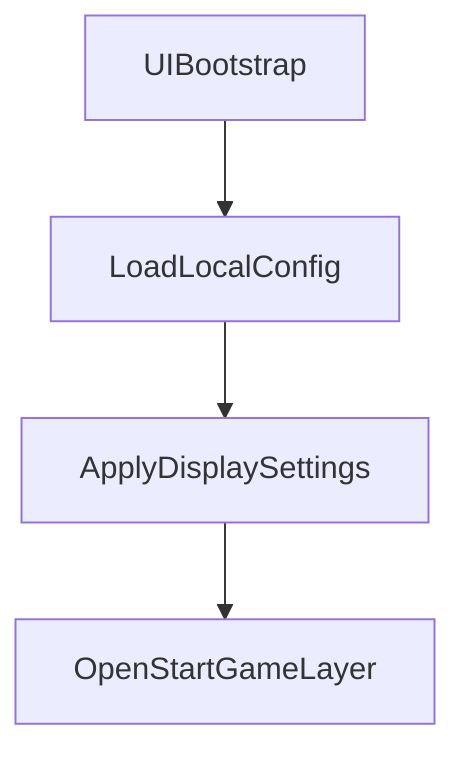

# 存档与本地配置架构

## 目标

FACTORIA 将持久化数据分成三类：

- `slot`：单个存档槽位内的世界进度。
- `profile`：跨存档槽位的玩家长期进度。
- `local config/cache`：本机运行设置与缓存。

这三类数据不能互相混用。尤其是系统设置不进入存档系统，避免换槽位或删除槽位时影响本机配置。

## 数据边界

### Slot 存档

`slot` 存档代表某个世界或工厂的进度，路径由 `SaveRepository` 管理：

- `user://saves/slot_01/main.json`
- `user://saves/slot_01/backup.json`
- `user://saves/slot_01/meta.dat`

适合放入 `slot` 的数据：

- 玩家在该世界中的角色数据。
- 地图状态。
- 工厂建筑、传送带、物流网络。
- 科技、任务、当前资源。
- 已放置的蓝图实例。

参与 `slot` 的 Controller 应返回：

```gdscript
func get_save_scope() -> StringName:
	return SAVE_SCOPE_SLOT
```

### Profile 存档

`profile` 存档代表跨槽位的玩家长期进度，路径由 `SaveRepository.PROFILE_DIR` 管理：

- `user://saves/profile/main.json`
- `user://saves/profile/backup.json`

适合放入 `profile` 的数据：

- 成就解锁。
- 跨世界统计。
- 全局教程完成状态。
- 全局解锁记录。

参与 `profile` 的 Controller 应返回：

```gdscript
func get_save_scope() -> StringName:
	return SAVE_SCOPE_PROFILE
```

`profile` 不存分辨率、音量、语言、按键等本机设置。

### Local Config / Cache

`local config/cache` 代表这台机器上的运行偏好，不属于存档系统。

适合放入本地配置的数据：

- 分辨率。
- 窗口 / 全屏模式。
- 音量。
- 语言。
- 按键映射。
- UI 缩放。
- 图形质量选项。

当前显示设置使用：

- `user://display_settings.cfg`

后续可逐步整理为：

- `user://config/display.cfg`
- `user://config/audio.cfg`
- `user://config/input.cfg`
- `user://cache/*.cache`

本地配置由对应 Controller 自己通过 `ConfigFile` 或专用配置仓库读写，不进入 `SaveManager`。

## 启动顺序

启动时应先加载本地配置，再打开主页面：



这样首次启动可以应用默认配置，后续启动可以应用玩家上次保存的本机设置。

## 成就系统 Profile

当前成就系统暂不需要 View 层，先放在：

- `assets/src/game/achievement/core/AchievementController.gd`
- `assets/src/game/achievement/model/AchievementModel.gd`

当前保存结构：

```gdscript
{
	"schema_version": 1,
	"unlocked": {
		"first_enter_planet": {
			"unlocked": true,
			"unlocked_at_unix": 1770000000,
			"source_slot_id": 1
		}
	}
}
```

成就 Controller 只参与 `SAVE_SCOPE_PROFILE`，删除任何 slot 都不应清空成就。

## 验证规则

- 修改系统设置后重启游戏，应读取本地配置并应用。
- 删除 slot 后，系统设置不变。
- 删除 slot 后，profile 成就不变。
- 保存 slot 时只写入 `SAVE_SCOPE_SLOT` 数据。
- 保存 profile 时只写入 `SAVE_SCOPE_PROFILE` 数据。
- `View` 不直接读写 `user://saves` 或 `user://config`。
