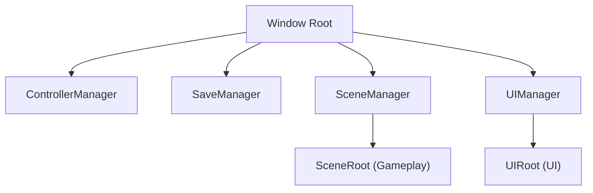
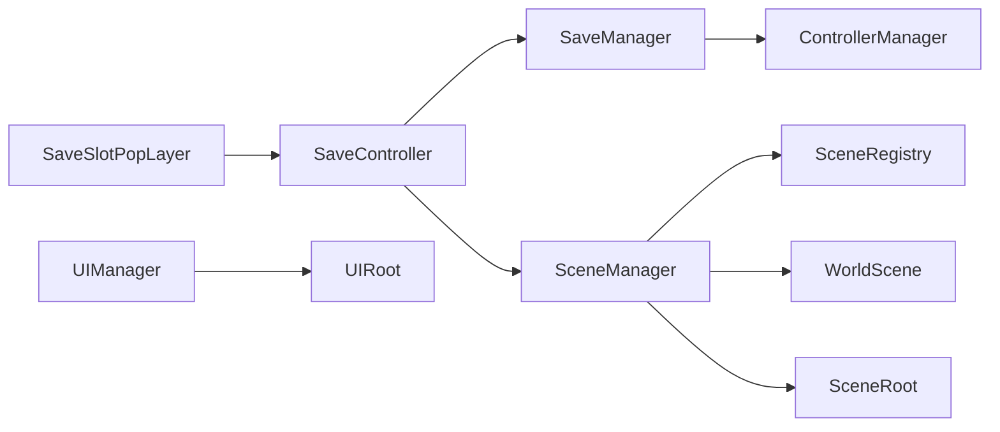

# SceneManager 与场景生命周期计划

## 目标结构

采用 `SceneManager` 作为 Autoload，位置在 `UIManager` 之前。`SceneManager._ready()` 创建 `SceneRoot`，`UIManager._ready()` 随后创建 `UIRoot`，因此节点顺序与显示层级为：



## 主要改动

1. 新增场景管理核心

- 新建 `[assets/src/core/scene-manager/SceneManager.gd](e:\factoria\factoria_v0.0.1\assets\src\core\scene-manager\SceneManager.gd)`。
- 新建 `[assets/src/core/scene-manager/SceneRegistry.gd](e:\factoria\factoria_v0.0.1\assets\src\core\scene-manager\SceneRegistry.gd)`，类似 `UIRegistry`，先注册 `WORLD_SCENE` 到 `res://assets/src/game/scene/world/WorldScene.tscn`。
- `SceneManager` 提供：
  - `open_scene(scene_id, params = {}, mode = replace)`
  - `close_current_scene()`
  - `get_current_scene()`
  - `set_scene_root_visible(is_visible)`
- 场景生命周期先使用约定方法派发，不强制继承某个 `BaseScene`，避免限制 `Node2D` / `Node3D`：
  - `on_scene_enter(params)`
  - `on_scene_show()`
  - `on_scene_hide()`
  - `on_scene_exit()`
  - `on_scene_destroy()`

2. 接入 Autoload 顺序

更新 `[project.godot](e:\factoria\factoria_v0.0.1\project.godot)`：

```gdscript
ControllerManager
SaveManager
SceneManager
UIManager
```

这样 `SceneRoot` 先加入 root，`UIRoot` 后加入 root，UI 层级自然在 gameplay 场景上方。

3. 迁移当前世界加载逻辑

当前 `[SaveController.gd](e:\factoria\factoria_v0.0.1\assets\src\ui\save\core\SaveController.gd)` 里直接加载世界场景：

```gdscript
const WORLD_SCENE_PATH: String = "res://assets/src/game/scene/world/WorldScene.tscn"
```

这部分会迁到 `SceneRegistry` / `SceneManager`。`SaveController.request_open_world()` 改为：

- 关闭来源 UI。
- 调用 `SceneManager.open_scene(SceneRegistry.WORLD_SCENE, { "slot_id": slot_id })`。
- 隐藏或关闭主 UI，保留 loading overlay 的关闭语义。

4. 调整世界场景生命周期

更新 `[WorldScene.gd](e:\factoria\factoria_v0.0.1\assets\src\game\scene\world\WorldScene.gd)`：

- 把 `setup(slot_id, loading_ui_instance_id)` 改为 `on_scene_enter(params)`。
- 在 `on_scene_enter` 中读取 `slot_id`。
- 在进入世界时记录 `first_enter_planet` 成就。
- 保持 `WorldScene.tscn` 根节点为 `Node2D`，不接 UI 系统。

5. 更新架构记录

- 更新 `[GAME_MODULE_ARCHITECTURE.mdc](e:\factoria\factoria_v0.0.1\.cursor\rules\GAME_MODULE_ARCHITECTURE.mdc)`：补充 gameplay scene 由 `SceneManager` 管理，不由 `UIManager` 打开。
- 更新 `[.cursor/README.md](e:\factoria\factoria_v0.0.1\.cursor\README.md)`：加入 `core/scene-manager` 规则入口或说明。
- 可选新增一条规则 `[SCENE_MANAGER_CONVENTION.mdc](e:\factoria\factoria_v0.0.1\.cursor\rules\SCENE_MANAGER_CONVENTION.mdc)`，专门约束 `SceneManager`、`SceneRegistry`、场景生命周期方法。

## 数据流



## 验证

- 读档成功后进入 `WorldScene.tscn`，不再由 `SaveController` 直接 `load()` 场景。
- `SceneRoot` 在节点树中位于 `UIRoot` 前面，UI 层级在 gameplay 场景上方。
- `WorldScene.on_scene_enter()` 能收到 `slot_id`。
- 删除/关闭旧世界场景时触发 `on_scene_exit()` 与 `on_scene_destroy()`。
- `ReadLints` 无报错，`.cursor/scripts/check-cursor-consistency.ps1` 通过。