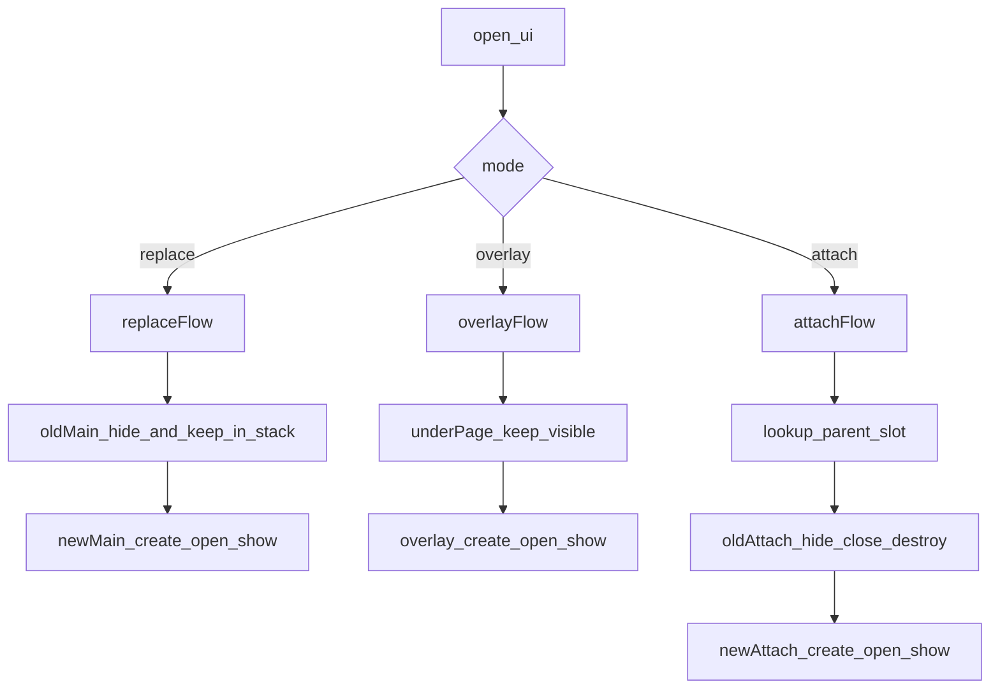

# UI 生命周期与页面编排蓝图（落地接口级）

## 目标与边界
- 建立统一 UI 编排入口，避免业务侧直接 `add_child`/`change_scene_to_packed` 导致生命周期不一致。
- 明确三种模式：`replace`（替换主页面）、`overlay`（覆盖层）、`attach`（父页面挂载子页面）。
- `attach` 默认采用“每次重建”策略：切换时旧实例销毁，新实例重建。
- 当前仓库已落地 `assets/src/core/ui-manager`、`assets/src/core/ui-controller-manager` 与若干 `assets/src/ui/<module>` 页面，本蓝图作为后续 UI 生命周期治理的约束。
- Controller / Model 层按 `assets/src/ui/<module>/{core,model}` 组织；UI 生命周期仍只收口到 `UIManager`，不把业务编排写进 view。

## 目标文件（设计落点）
- 新增基类：`res://assets/src/core/ui-manager/BaseUI.gd`
- 新增管理器：`res://assets/src/core/ui-manager/UIManager.gd`
- 新增注册表：`res://assets/src/core/ui-manager/UIRegistry.gd`
- 新增根节点场景（层级容器）：`res://assets/src/core/ui-manager/UIRoot.tscn`
- 接入点调整：`project.godot`（Autoload / 主场景接入）
- 首批迁移页面：以后续实际页面为准，建议从第一个主页面和第一个弹窗页面开始。
- 配套规范：`.cursor/rules/UI_LIFECYCLE.mdc`、`.cursor/rules/UI_VIEW_SCRIPT_REGION_STYLE.mdc`

## 生命周期模型（页面级）
- `on_ui_create(params: Dictionary) -> void`：实例创建后调用一次。
- `on_ui_open(params: Dictionary) -> void`：每次打开时调用。
- `on_ui_show() -> void`：页面可见并可交互。
- `on_ui_hide() -> void`：页面离开可见状态。
- `on_ui_close() -> void`：业务关闭阶段（可做状态落盘、请求取消）。
- `on_ui_destroy() -> void`：对象销毁前最终清理。
- `_ready/_exit_tree` 只做 Godot 节点层初始化/清理，不承载业务流程编排。

## 模式语义与状态流
- `replace`：当前主页面 `hide`，新主页面 `create -> open -> show`；旧主页面保留在主栈中，调用 `close_ui()` 后恢复上一页。
- `overlay`：覆盖层 `create -> open -> show`；不触发下层页面 `hide/show`，仅按需要处理输入遮挡。
- `attach(parent, slot)`（默认重建）：
  - 旧 attach（同 `parent+slot`）执行 `hide -> close -> destroy`。
  - 新 attach 执行 `create -> open -> show`，并挂到父页面指定 slot 容器。

## 接口设计（UIManager）
- `open_ui(ui_id: StringName, params: Dictionary = {}, mode: StringName = &"replace") -> BaseUI`
- `open_overlay(ui_id: StringName, params: Dictionary = {}) -> BaseUI`
- `open_attach(parent_ui_id: StringName, slot_id: StringName, ui_id: StringName, params: Dictionary = {}) -> BaseUI`
- `close_ui(ui_id: StringName = &"") -> void`
- `close_top_overlay() -> void`
- `close_attach(parent_page_id: StringName, slot_id: StringName) -> void`

## 数据结构设计
- `ui_registry: Dictionary[StringName, Dictionary]`
  - `scene_path`, `default_mode`, `layer`, `block_input`, `allow_multi_instance`。
- `ui_stack: Array[BaseUI]`：主页面栈，栈底根页面不允许被普通 `close_ui()` 弹出。
- `overlay_stack: Array[BaseUI]`：覆盖层栈。
- `attach_map: Dictionary[StringName, BaseUI]`：key=`"parent:slot"`，value=当前 attach。
- `ui_instance_index: Dictionary[int, BaseUI]`：按实例 id 快速关闭或调试定位。

## 与当前工程的迁移策略
- 第一步先落地空框架：`BaseUI.gd`、`UIManager.gd`、`UIRegistry.gd`、`UIRoot.tscn`。
- 第二步接入 `project.godot`，确认 Autoload 和根节点容器能在空项目中启动。
- 第三步新增最小主页面与一个 overlay 页面，用于验证 `replace`、`overlay`、`close_ui()`。
- 第四步再引入 UI 页面目录：`assets/src/ui/<module>/view/*.gd`，并按 `.cursor/rules/UI_VIEW_SCRIPT_REGION_STYLE.mdc` 组织 region。
- 第五步按当前 `assets/src/ui/<module>/{view,core,model}` 结构维护 Controller / Model 规范，不再沿用外项目的 `assets/src/modules` 路径。

## 验证标准（按你当前关注点）
- 场景替换：切换页面时旧页生命周期完整触发且节点无残留。
- 页面恢复：调用 `close_ui()` 后，当前主页面关闭且上一主页面恢复 `show`。
- 弹窗覆盖：overlay 关闭后下层状态不被破坏，输入遮挡状态正确。
- attach 切换（重建）：同 slot 切换 A->B 时 A 必然销毁，B 必然新建。
- 父页关闭：所有 attach 级联 `close+destroy`，无悬挂引用。
- 日志可观测：每个页面生命周期阶段有统一 debug 日志。

## 风险与约束
- 迁移期会有“新旧入口并存”风险，必须禁用业务侧直连 `change_scene_to_packed`。
- attach 默认重建会增加实例化成本，后续可按页面白名单升级为可缓存策略。
- 页面脚本需要统一继承 `BaseUI`，存在一次性改造成本。
- 当前工程已有 UI 基础链路，后续扩展应继续以最小可运行链路为先，不一次性铺满所有页面类型。
